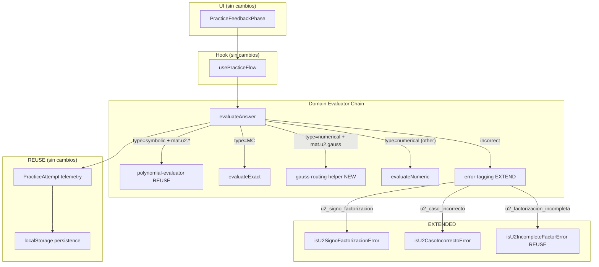
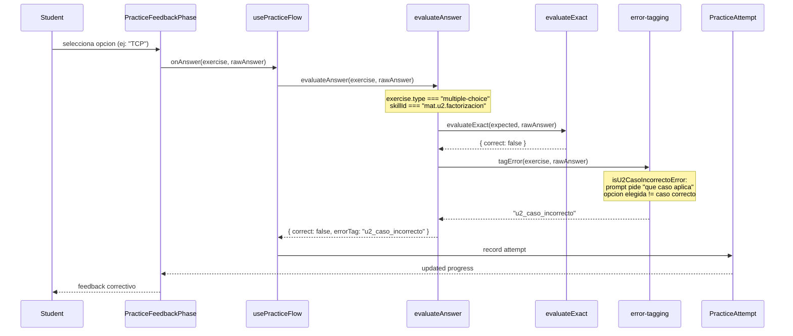
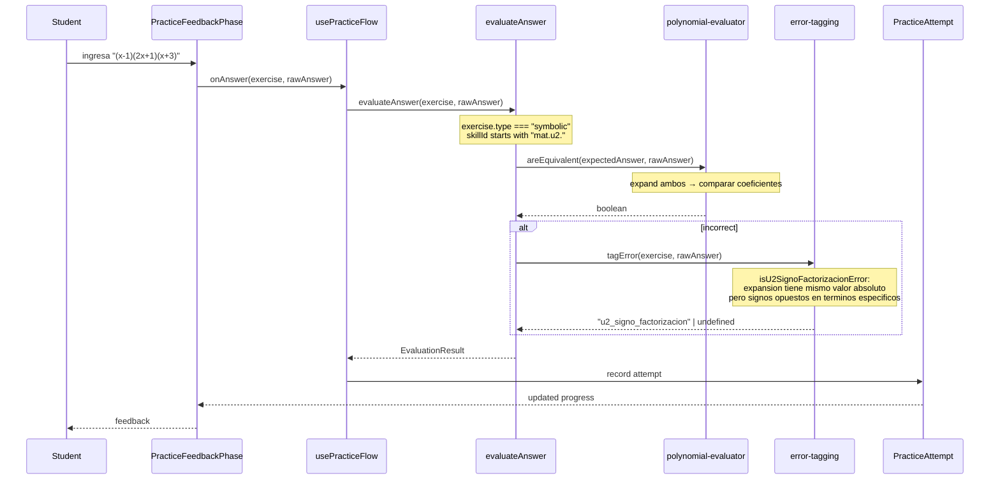
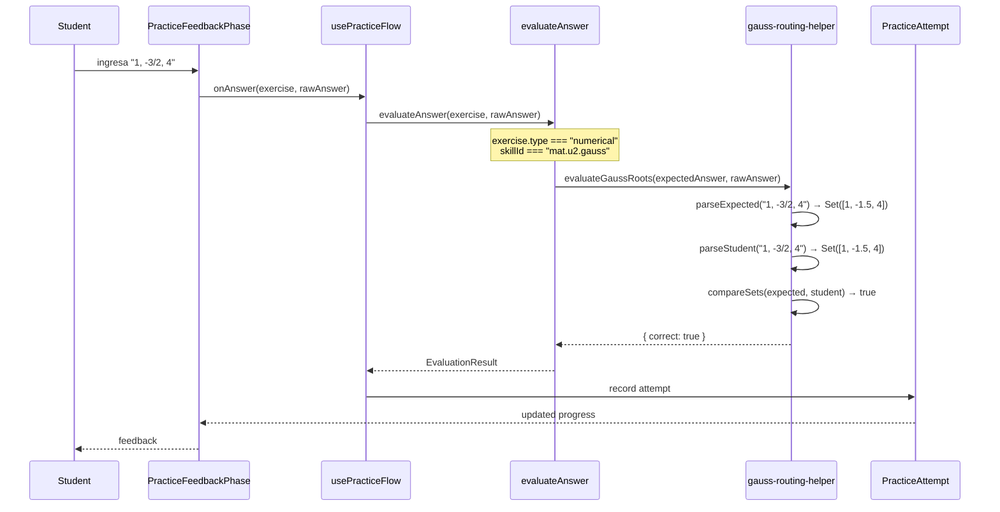

# Design: unit-2-factorizacion-slice

> **Change:** unit-2-factorizacion-slice
> **Date:** 2026-06-10
> **Status:** designed
> **Depends on:** proposal.md, 4 delta specs (math-error-taxonomy, math-answer-evaluator, math-exercise-catalog, math-skill-model)

---

## 1. Resumen arquitectonico

Este slice implementa los 2 skills restantes de la cadena principal de U2: `mat.u2.factorizacion` (7 casos de factoreo) y `mat.u2.gauss` (teorema de Gauss para raices racionales). No se construyen modulos de dominio nuevos — el `polynomial-evaluator` del slice anterior (1273 tests, bug-fixed) se reutiliza tal cual para ejercicios symbolic de factorizacion.

El trabajo se concentra en cuatro areas: (1) un helper nuevo `gauss-routing-helper.ts` para comparar raices racionales (orden-insensible, fracciones exactas), (2) extension de la taxonomia con 2 tags `u2_*` y sus detectores en `error-tagging.ts`, (3) contenido JSON (2 TheoryNodes, 2-4 WorkedExamples, 3-5 FeedbackMappings, 8 ejercicios), y (4) una dependencia nueva en `SKILL_DEPENDENCIES` (`factorizacion <- ruffini_resto`).

La arquitectura runtime es identica al slice anterior: mismo flujo UI → hook → evaluator chain → polynomial-evaluator → error-tagging → telemetry → persistencia. Los unicos deltas son un routing branch para Gauss numerico y 2 patrones de error nuevos.

---

## 2. Vista de capas



---

## 3. Diagrama de secuencia: MC "identificar caso de factoreo"



---

## 4. Diagrama de secuencia: symbolic "factorizar completamente"



---

## 5. Diagrama de secuencia: gauss numerico "encontrar raices racionales"



---

## 6. Estructura de archivos

### NEW files

| File | Description |
|------|-------------|
| `src/domain/evaluator/gauss-routing-helper.ts` | Parse rational roots ("1/2", "-3/2", "0.5"), normalize to number, compare sets order-insensitive |
| `src/domain/__tests__/gauss-routing-helper.test.ts` | TDD tests: parse fractions, parse decimals, set comparison, order-insensitive, extras |
| `src/domain/__tests__/error-tagging-u2-factorizacion.test.ts` | TDD tests: u2_signo_factorizacion (+/-), u2_caso_incorrecto (+/-) |
| `src/domain/__tests__/factorizacion-exercises-shape.test.ts` | TDD tests: 8 exercises conform to model, IDs unique, difficulty progression, commonErrorTags non-empty |
| `src/domain/__tests__/skill-catalog-factorizacion-deps.test.ts` | TDD test: factorizacion.prerequisites includes ruffini_resto |

### MODIFIED files

| File | Description |
|------|-------------|
| `src/domain/evaluator/index.ts` | Add gauss-routing import + branch for `type=numerical && skillId === "mat.u2.gauss"` |
| `src/domain/evaluator/error-tagging.ts` | Add `isU2SignoFactorizacionError`, `isU2CasoIncorrectoError` + tag sets; wire into `tagError` |
| `src/domain/error-taxonomy/index.ts` | Add 2 entries: `u2_signo_factorizacion`, `u2_caso_incorrecto` |
| `src/domain/models/skill-catalog.ts` | Change line 115: add `"mat.u2.ruffini_resto"` to factorizacion prerequisites |
| `content/matematica/exercises.json` | Update `ex.u2.factorizacion.1` commonErrorTags; recreate `ex.u2.gauss.1` as U2 gauss; add 6 new exercises |
| `content/matematica/theory/unit-2.json` | Add 2 TheoryNodes: factorizacion (7 sub-bloques) + gauss |
| `content/matematica/examples/unit-2.json` | Add 2-4 WorkedExamples (at least 1 factorizacion, 1 gauss) |
| `content/matematica/feedback/unit-2.json` | Add 3-5 FeedbackMappings for new tags |

---

## 7. Decisiones arquitectonicas (ADRs)

### ADR-001: `mat.u2.factorizacion` permanece como skill unico con 7 casos como sub-bloques

| Option | Tradeoff | Decision |
|--------|----------|----------|
| 1 skill, 7 sub-bloques en TheoryNode | +Sin churn de modelo, +compatible con SKILL_DEPENDENCIES downstream | **Elegido** |
| 2 sub-skills (basica + avanzada) | +Progresion pedagogica, -Rompe grafo (gauss, mcm_mcd, ecuaciones_fraccionarias) | Rechazado |
| 1 skill sin sub-bloques | +Simple, -Demasiado plano para 7 casos | Rechazado |

**Consecuencias**: El TheoryNode tendra 7 conceptBlocks (uno por caso). Patron ya establecido en U1 `complejos` (8 conceptBlocks en un solo nodo).

### ADR-002: `gauss-routing-helper.ts` como modulo separado, no extension de polynomial-evaluator

| Option | Tradeoff | Decision |
|--------|----------|----------|
| Modulo nuevo `gauss-routing-helper.ts` | +SRP, +TDD aislado, -1 archivo mas | **Elegido** |
| Extender polynomial-evaluator con `areEquivalentRoots()` | -Mezcla responsabilidades (coeficientes vs raices) | Rechazado |
| Inline en evaluator/index.ts | -No testeable en aislamiento | Rechazado |

**Consecuencias**: 1 archivo nuevo (~40 lineas), 1 test file (~60 lineas). El polynomial-evaluator permanece enfocado en equivalencia polinomica.

### ADR-003: `ex.u2.gauss.1` se re-crea con contenido U2 correcto (raices racionales de cubico)

| Option | Tradeoff | Decision |
|--------|----------|----------|
| Re-crear con contenido gauss U2 | +Honra placeholder, +ID coherente | **Elegido** |
| Usar `ex.u2.gauss.2` y dejar `.1` reservado | -Confuso, +Nunca usado | Rechazado |
| No recrear, solo `.2-.5` | -Viola spec U2FAC-CAT-005 | Rechazado |

**Consecuencias**: Tests que referencian `ex.u2.gauss.1` con skillId `mat.u3.sistemas` deben actualizarse. El ejercicio original de eliminacion gaussiana ya vive en U3 con su ID correcto.

### ADR-004: Raices de Gauss se comparan como SET (orden-insensible), con igualdad fraccionaria exacta

| Option | Tradeoff | Decision |
|--------|----------|----------|
| Set comparison con parse a number | +Orden-insensible, +"1/2" = "0.5" | **Elegido** |
| Comparacion orden-sensitive | -Penaliza orden correcto | Rechazado |
| String-set comparison | -"1/2" != "0.5" seria falso negativo | Rechazado |

**Consecuencias**: El helper parsea "a/b" → `a/b` (division), "0.5" → `0.5`, enteros → number. Comparacion con tolerancia 1e-9 para decimales recurrentes (1/3 = 0.333...). Los ejercicios usaran solo fracciones con denominador que produzca decimal terminado (2, 4, 5, 8, 10) para evitar el edge case.

### ADR-005: Routing de Gauss numerico por skillId + type, no por evaluatorId

| Option | Tradeoff | Decision |
|--------|----------|----------|
| Patron `type=numerical && skillId=mat.u2.gauss` | +Consistente con routing guard U2 existente, +sin cambio de modelo | **Elegido** |
| Campo `evaluatorId: "gauss"` en Exercise | -Cambio de interfaz, -migracion | Rechazado |

**Consecuencias**: El evaluator/index.ts agrega un branch antes del switch principal. Los ejercicios MC y symbolic de gauss siguen los paths existentes (MC → evaluateExact, symbolic → polynomial-evaluator).

---

## 8. Contratos de datos

### GaussExercise expectedAnswer

```typescript
// Para ejercicios gauss type=numerical:
// expectedAnswer es string con raices separadas por coma
// Formato: "1, -3/2, 4" o "1, -1.5, 4"
// El helper normaliza ambos formatos a Set<number>
```

### GaussAnswerInput (lo que ingresa el alumno)

```typescript
// String libre con raices separadas por coma o espacio
// El helper acepta: "1, -3/2, 4" | "1 -3/2 4" | "1,-3/2,4"
// Cada token se parsea individualmente
```

### Nuevos error tags (extienden ErrorTag existente)

```typescript
// u2_signo_factorizacion
{
  id: "u2_signo_factorizacion",
  unit: 2,
  description: "Error de signo al elegir los factores...",
  examples: ["Factorizar x²-9 como (x-3)² en vez de (x-3)(x+3)"]
}

// u2_caso_incorrecto
{
  id: "u2_caso_incorrecto",
  unit: 2,
  description: "Aplica un caso de factoreo que no corresponde...",
  examples: ["Aplicar TCP a x²+5x+6 cuando no es cuadrado perfecto"]
}
```

---

## 9. Estrategia de TDD

### gauss-routing-helper.test.ts (RED → GREEN → REFACTOR)

| Grupo | Tests | Escenario |
|-------|-------|-----------|
| parse: enteros | 2 | "4" → 4, "-3" → -3 |
| parse: fracciones | 3 | "1/2" → 0.5, "-3/2" → -1.5, "4/1" → 4 |
| parse: decimales | 2 | "0.5" → 0.5, "-1.5" → -1.5 |
| set comparison: equivalentes | 2 | Mismas raices, orden diferente |
| set comparison: extras | 2 | Raiz extra → false |
| set comparison: faltantes | 2 | Raiz faltante → false |
| set comparison: signo | 2 | "3" vs "-3" → false |
| input normalization | 3 | Whitespace, comas mixtas, vacios |

### error-tagging-u2-factorizacion.test.ts

| Grupo | Tests | Tag |
|-------|-------|-----|
| u2_signo_factorizacion MC | 2 (+, -) | Distractor con signos invertidos |
| u2_signo_factorizacion symbolic | 2 (+, -) | Expansion con signos opuestos |
| u2_caso_incorrecto MC | 2 (+, -) | Caso erroneo identificado |
| No tagea si tag no declarado | 2 | commonErrorTags vacio → undefined |

### factorizacion-exercises-shape.test.ts

| Grupo | Tests |
|-------|-------|
| 8 ejercicios existen | 1 |
| IDs unicos | 1 |
| Distribucion tipos (4 MC, 2 num, 2 sym) | 1 |
| Progresion dificultad (monotona) | 2 (factorizacion + gauss) |
| commonErrorTags no vacio | 1 |
| ex.u2.factorizacion.1 tiene tags | 1 |
| ex.u2.gauss.1 skillId es mat.u2.gauss | 1 |
| Sin texto libre | 1 |

### skill-catalog-factorizacion-deps.test.ts

| Grupo | Tests |
|-------|-------|
| factorizacion tiene ruffini_resto | 1 |
| factorizacion mantiene operaciones_polinomios | 1 |
| Cadena sin ciclos | 1 |

### Regresion U1 + U2-Fundamentos

| Grupo | Tests |
|-------|-------|
| polynomial-evaluator tests pasan | Implicito (pnpm run test) |
| error-tagging U1/U2-Fundamentos sin cambios | Cubierto por tests existentes |

**Estimacion total**: ~40-55 tests nuevos.

---

## 10. Estimacion de tamano

| Categoria | Lineas estimadas |
|-----------|-----------------|
| New TS code (gauss-helper + 2 detectores) | ~80-120 |
| New tests | ~150-200 |
| New content JSON (theory + examples + feedback) | ~150-200 |
| Modified existing (taxonomy, tagging, catalog, index, exercises) | ~30-50 |
| **Total diff** | **~410-570** |

**Recomendacion**: 2 chained PRs (stacked-to-main):

| PR | Contenido | Lineas aprox. |
|----|-----------|---------------|
| PR-1: Domain helpers + tests | gauss-helper, 2 detectores, 2 tags, skill-catalog dep, evaluator routing, ~40 tests | ~250 |
| PR-2: Content JSON + exercises | 2 TheoryNodes, 2-4 examples, 3-5 feedback, 8 ejercicios, ~15 tests | ~200 |

---

## 11. Riesgos tecnicos residuales

| Riesgo | Severidad | Mitigacion |
|--------|-----------|------------|
| Decimales recurrentes (1/3 = 0.333...) en comparacion Gauss | Media | Ejercicios usaran solo fracciones con decimal terminado (denominador 2, 4, 5, 8, 10). Tolerancia 1e-9 como fallback. |
| `ex.u2.gauss.1` conflicto con tests existentes que referencian skillId `mat.u3.sistemas` | Media | Search & replace en tests afectados. Verificar con `pnpm run test` tras el cambio. |
| Dificultad 120s para ejercicios de factorizacion dificultad 3-4 | Baja | Los ejercicios symbolic de factorizacion tienen polinomios con coeficientes pequenos. El time limit se valida en verify phase. |
| Sub-block structure (7 conceptBlocks) es patron nuevo para U2 | Baja | U1 `complejos` ya tiene 8 conceptBlocks. Mismo schema, sin cambio de modelo. |
| Los 2 nuevos detectores deben funcionar en MC Y symbolic | Media | Cada detector tiene tests para ambos contextos. `isU2SignoFactorizacionError` usa polynomial-evaluator para symbolic. |

---

## 12. Compatibilidad y migracion

- **Backward compat**: U1 y U2-Fundamentos evaluadores, content loaders, skill graph — sin cambios. El polynomial-evaluator bug-fixed continua funcionando.
- **Forward compat**: U2 content JSON usa `unit: 2` discriminator; el engine rutea por skillId. Futuro U2-Aplicaciones (mcm_mcd, ecuaciones_fraccionarias) seguira el mismo patron.
- **Data migration**: NONE. El slice anterior dejo la estructura limpia.
- **Public APIs**: sin cambios de API publica. `gauss-routing-helper` es un export interno del dominio.
- **Rollback**: revertir merge commit de cada PR. Los cambios son aditivos (nuevas entradas en arrays JSON, nuevos tags) o extensiones puntuales. Sin destructive mutations sobre el slice anterior.

---

## Open Questions

- [ ] None — todas las preguntas abiertas de la exploracion fueron resueltas en la propuesta y specs.
