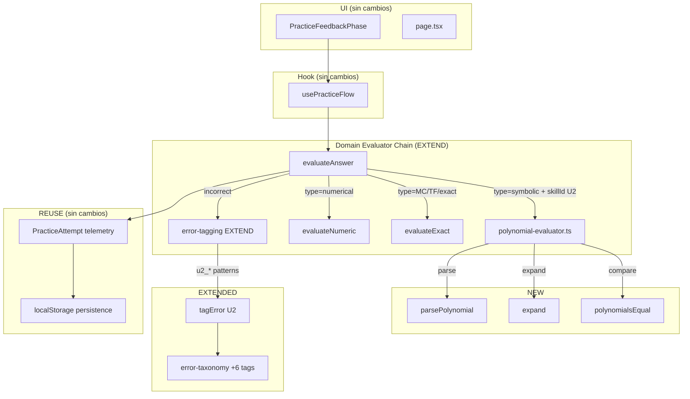
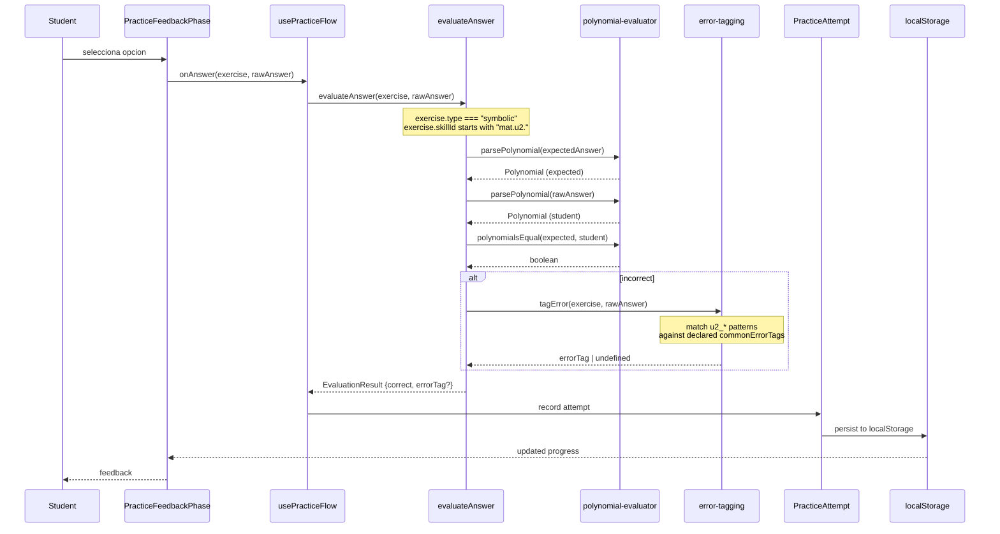
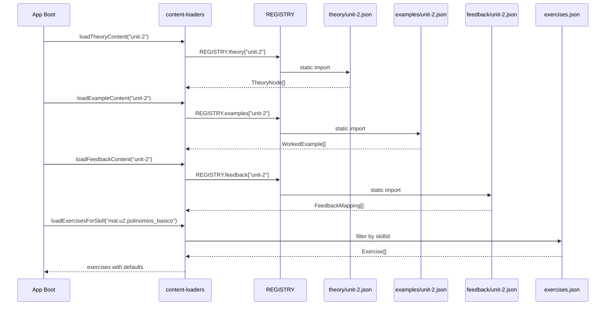

# Design: unit-2-pedagogical-slice

> **Change:** unit-2-pedagogical-slice
> **Date:** 2026-06-10
> **Status:** designed
> **Depends on:** proposal.md, 5 specs (polynomial-evaluator, math-exercise-catalog, math-error-taxonomy, math-answer-evaluator, math-skill-model)

---

## 1. Resumen arquitectonico

Este slice extiende la infraestructura pedagogica de U1 para cubrir los primeros 3 skills de la Unidad 2 (Polinomios): `polinomios_basico`, `operaciones_polinomios`, `ruffini_resto`. No se construye infraestructura nueva — todo el flujo (teoria → ejemplo → practica → feedback → persistencia → metricas) se reutiliza desde U1.

El trabajo nuevo se concentra en tres areas: (1) un modulo de dominio `polynomial-evaluator` que verifica equivalencia polinomica mediante expansion y comparacion de coeficientes, (2) contenido JSON (teoria, ejemplos, feedback, 12 ejercicios) que sigue exactamente el mismo schema que U1, y (3) extensiones puntuales a la cadena de evaluacion (routing polinomico), taxonomia de errores (6 tags `u2_*`) y grafo de dependencias (2 prerrequisitos faltantes).

La reubicacion de `ex.u2.gauss.1` a `mat.u3.sistemas` corrige un error de clasificacion sin eliminar contenido. Ningun cambio de UI es necesario — los tipos de ejercicio existentes (`multiple-choice`, `numerical`, `symbolic`) cubren los 12 ejercicios nuevos.

---

## 2. Vista de capas



---

## 3. Diagrama de secuencia: student answers a U2 polynomial MCQ



---

## 4. Diagrama de secuencia: U2 content loading at app start



---

## 5. Estructura de archivos

### NEW domain code

| File | Description |
|------|-------------|
| `src/domain/evaluator/polynomial-evaluator.ts` | Modulo principal: parsePolynomial, expand, polynomialsEqual, areEquivalent |
| `src/domain/evaluator/polynomial-types.ts` | Tipos: Polynomial, PolynomialParseError, UnsupportedPolynomialFormError |
| `src/domain/__tests__/polynomial-evaluator.test.ts` | Tests TDD: parse, expand, equivalence, error model |
| `src/domain/__tests__/polynomial-evaluator.edge-cases.test.ts` | Edge cases: zero poly, leading zeros, MAX_SAFE_INTEGER, negativos |
| `src/domain/__tests__/evaluator-error-tagging-u2.test.ts` | Tests para los 6 patrones u2_* en error-tagging |

### MODIFIED domain code

| File | Description |
|------|-------------|
| `src/domain/evaluator/index.ts` | Agregar rama polynomial en switch: si type=symbolic y skillId es U2, delegar a polynomial-evaluator |
| `src/domain/evaluator/error-tagging.ts` | Agregar 6 funciones isU2*Error + sets de tags u2_* |
| `src/domain/error-taxonomy/index.ts` | Agregar 6 entradas u2_* al array TAXONOMY |
| `src/domain/models/skill-catalog.ts` | Agregar 2 entradas en SKILL_DEPENDENCIES: gauss←ruffini_resto, mcm_mcd←factorizacion |
| `src/domain/catalog/content-loaders.ts` | Importar + registrar theory/examples/feedback unit-2 en REGISTRY |

### NEW content data

| File | Description |
|------|-------------|
| `content/matematica/theory/unit-2.json` | 3 TheoryNodes (uno por skill del slice) |
| `content/matematica/examples/unit-2.json` | 4-6 WorkedExamples (incluye division larga como ejemplo trabajado) |
| `content/matematica/feedback/unit-2.json` | FeedbackMappings para los 6 tags u2_* |

### MODIFIED content data

| File | Description |
|------|-------------|
| `content/matematica/exercises.json` | Agregar 12 ejercicios U2 nuevos; cambiar skillId de ex.u2.gauss.1 a mat.u3.sistemas |

### NEW or MODIFIED UI: NONE

---

## 6. Decisiones arquitectonicas (ADRs)

### ADR-001: polynomial-evaluator como modulo separado

| Option | Tradeoff | Decision |
|--------|----------|----------|
| Nuevo modulo `polynomial-evaluator.ts` | +SRP, -TDD aislado, -1 archivo mas | **Elegido** |
| Extender `exact.ts` con logica polinomica | -Mezcla responsabilidades, -testing mas dificil | Rechazado |
| Inline en `index.ts` | -Dispatcher se infla, -imposible testear unitariamente | Rechazado |

**Consecuencias**: un import mas en `index.ts`, pero el modulo es completamente testeable en aislamiento. Los evaluadores U1 no se tocan.

### ADR-002: Equivalencia por expansion solamente (v1)

| Option | Tradeoff | Decision |
|--------|----------|----------|
| Solo expandir + comparar coeficientes | +TDD tratable, +suficiente para caps 1-11 | **Elegido** |
| Expansion + factorizacion inversa | -Complejidad exponencial, -fuera de scope U2-fundamentos | Rechazado |
| CAS externo (mathjs) | -Dependencia nueva, -bundle size | Rechazado |

**Consecuencias**: `(x-2)(x+3)` se acepta como equivalente a `x²+x-6` (ambos expanden a `[1,1,-6]`). No se acepta factorizacion inversa (pedir "factorizar x²+x-6" y responder `(x-2)(x+3)` requiere que el ejercicio use MC con opciones factorizadas). Diferido a slice U2-Factorizacion.

### ADR-003: Error tagging U2 con patrones deterministas (regex + comparacion numerica)

| Option | Tradeoff | Decision |
|--------|----------|----------|
| Regex + comparacion numerica (patron U1) | +Determinista, +testable, +sin perf cost | **Elegido** |
| ML/fuzzy matching | -No hay training data, -dependencia externa | Rechazado |
| String similarity (Levenshtein) | -No captura semantica matematica | Rechazado |

**Consecuencias**: cada tag u2_* tiene funcion dedicada en `error-tagging.ts` siguiendo el patron existente (isXError + Set de tags). Edge cases como `+1x²` vs `x²` requieren patrones cuidadosos pero son tratables.

### ADR-004: ex.u2.gauss.1 se reubica, no se elimina

| Option | Tradeoff | Decision |
|--------|----------|----------|
| Cambiar skillId a mat.u3.sistemas | +Preserva contenido, +corrige clasificacion | **Elegido** |
| Eliminar ejercicio | -Pierde trabajo existente | Rechazado |
| Reescribir como Gauss polinomios | -Scope creep, -conflicto con slice futuro | Rechazado |

**Consecuencias**: `ex.u2.gauss.1` queda con `skillId: "mat.u3.sistemas"`. El ID `ex.u2.gauss.1` queda libre para un ejercicio futuro de teorema de Gauss. El catalogo de U3 debera registrar este ejercicio cuando se implemente.

### ADR-005: Sin nuevo tipo de ejercicio para U2

| Option | Tradeoff | Decision |
|--------|----------|----------|
| Usar tipos existentes (MC, numerical, symbolic) | +Sin cambio de modelo, +12 ejercicios modelables | **Elegido** |
| Nuevo tipo "coefficient-input" | -Cambio de modelo, -UI changes | Rechazado |
| Nuevo tipo "fill-blank-polynomial" | -Scope creep, -redundante con symbolic | Rechazado |

**Consecuencias**: algunos ejercicios seran MC por necesidad donde un fill-blank seria mas autentico (ej: "completar el polinomio" → MC con 4 opciones). Aceptable para el slice; re-evaluar en U2-Factorizacion.

### ADR-006: Content JSON con discriminador unit: 2

| Option | Tradeoff | Decision |
|--------|----------|----------|
| `unit: 2` en JSON, mismo schema que U1 | +Zero cambios en loader dispatch, +validacion reutilizada | **Elegido** |
| Schema nuevo para U2 | -Duplica logica, -breaking change | Rechazado |

**Consecuencias**: los loaders existentes (`loadTheoryContent`, `loadExampleContent`, `loadFeedbackContent`) funcionan sin modificaciones de firma. Solo se agregan entradas al REGISTRY.

### ADR-007: Routing polinomico por skillId, no por evaluatorId

| Option | Tradeoff | Decision |
|--------|----------|----------|
| Routing por patron skillId (`mat.u2.*` + type=symbolic) | +Sin cambio de modelo Exercise, +convencion existente | **Elegido** |
| Agregar campo `evaluatorId` al modelo Exercise | -Cambio de interfaz, -migracion de ejercicios existentes | Rechazado |

**Consecuencias**: el dispatcher en `index.ts` agrega una guarda antes del switch: si `exercise.type === "symbolic"` y `exercise.skillId` matchea `^mat\.u2\.`, delega a `polynomial-evaluator`. Los ejercicios U2 numericos y MC siguen los paths existentes. Si en el futuro se necesita `evaluatorId` como campo, se agrega como cambio de modelo con migracion explicita.

---

## 7. Contratos de datos

### Polynomial type (nuevo)

```typescript
// src/domain/evaluator/polynomial-types.ts

export interface Polynomial {
  readonly coefficients: readonly number[]; // descending degree order
  readonly variable: string;                // default "x"
}

export class PolynomialParseError extends Error {
  readonly position: number;
  readonly reason: string;
  constructor(position: number, reason: string) {
    super(`Parse error at position ${position}: ${reason}`);
    this.position = position;
    this.reason = reason;
  }
}

export class UnsupportedPolynomialFormError extends Error {
  readonly formType: string;
  readonly reason: string;
  constructor(formType: string, reason: string) {
    super(`Unsupported form "${formType}": ${reason}`);
    this.formType = formType;
    this.reason = reason;
  }
}
```

### API publica del modulo

```typescript
// src/domain/evaluator/polynomial-evaluator.ts

export function parsePolynomial(input: string | readonly number[]): Polynomial;
export function expand(p: Polynomial): Polynomial;
export function polynomialsEqual(a: Polynomial, b: Polynomial): boolean;
export function areEquivalent(a: string, b: string): boolean;
```

### Content JSON shape (reutiliza U1 schemas)

**theory/unit-2.json**: `TheoryNode[]` — mismo schema que `unit-1.json`, con `skillId` apuntando a skills U2.

**examples/unit-2.json**: `WorkedExample[]` — mismo schema que `unit-1.json`, con `canonicalTrace` referenciando `UNIDAD2_matemática.pdf`.

**feedback/unit-2.json**: `FeedbackMapping[]` — mismo schema que `unit-1.json`:
```json
{
  "errorTag": "u2_signo_operacion",
  "type": "corrective",
  "message": "Revisa el signo al operar polinomios...",
  "recoveryTarget": "theory-u2-operaciones"
}
```

### SKILL_DEPENDENCIES additions

```typescript
{ skillId: "mat.u2.gauss", prerequisites: ["mat.u2.ruffini_resto"] },
{ skillId: "mat.u2.mcm_mcd_polinomios", prerequisites: ["mat.u2.factorizacion"] },
```

---

## 8. Estrategia de TDD

### polynomial-evaluator.test.ts (RED → GREEN → REFACTOR)

| Grupo | Tests | Escenarios spec |
|-------|-------|-----------------|
| parse: forma expandida | 4 | U2-POLY-001, variantes con/without variable |
| parse: forma factorizada | 3 | U2-POLY-002, conmutatividad |
| parse: arreglo coeficientes | 2 | U2-POLY-003 |
| expand | 3 | productos de binomios, polinomios por constantes |
| equivalence | 3 | U2-POLY-004, U2-POLY-005, U2-POLY-010 |
| error model | 3 | U2-POLY-006, U2-POLY-007 |

### polynomial-evaluator.edge-cases.test.ts

| Grupo | Tests |
|-------|-------|
| Zero polynomial | 2 (U2-POLY-008, `[0]` input) |
| Leading zeros | 2 (U2-POLY-009) |
| MAX_SAFE_INTEGER | 1 |
| Negative coefficients | 2 |
| Constant polynomial | 1 |
| Degree 1 (linear) | 1 |

### evaluator-error-tagging-u2.test.ts

| Grupo | Tests | Tag |
|-------|-------|-----|
| u2_signo_operacion | 2 (+, -) | Sign flip en coeficientes |
| u2_termino_semejante | 2 (+, -) | Terminos no reducidos |
| u2_ruffini_signo_a | 2 (+, -) | P(+a) vs P(-a) |
| u2_grado_incorrecto | 2 (+, -) | Grado declarado vs real |
| u2_termino_faltante | 2 (+, -) | Coeficientes cero omitidos |
| u2_factorizacion_incompleta | 2 (+, -) | Factorizacion parcial |

### content-loaders-unit-2.test.ts

| Grupo | Tests |
|-------|-------|
| loadTheoryContent("unit-2") | 1 (carga, no vacio) |
| loadExampleContent("unit-2") | 1 |
| loadFeedbackContent("unit-2") | 1 |
| loadExercisesForSkill U2 | 3 (uno por skill, 4 ejercicios c/u) |

### skill-catalog-u2-deps.test.ts

| Grupo | Tests |
|-------|-------|
| gauss depende de ruffini_resto | 1 (U2-SKILL-001) |
| mcm_mcd depende de factorizacion | 1 |
| No ciclos | 1 |
| Skills fuera del slice no ready | 1 (U2-SKILL-002) |

### exercises-u2-shape.test.ts

| Grupo | Tests |
|-------|-------|
| 12 ejercicios nuevos existen | 1 |
| IDs unicos | 1 |
| Distribucion de tipos (6 MC, 3 num, 3 sym) | 1 (U2-CAT-002) |
| Progresion de dificultad | 3 (U2-CAT-005) |
| Sin texto libre | 1 (U2-CAT-003) |
| commonErrorTags no vacio | 1 (U2-CAT-006) |
| gauss.1 relocated | 1 (U2-CAT-007) |

### u1-regression.test.ts

| Grupo | Tests |
|-------|-------|
| Todos los tests U1 evaluator siguen pasando | Implicito (pnpm run test) |
| error-tagging U1 sin cambios | Cubierto por evaluator-error-tagging.test.ts existente |

**Estimacion total**: ~80-100 tests nuevos.

---

## 9. Estimacion de tamano

| Categoria | Lineas estimadas |
|-----------|-----------------|
| New TS code (polynomial-evaluator + types) | ~150-180 |
| Modified TS (index.ts, error-tagging.ts, taxonomy, catalog, loaders) | ~100-130 |
| New tests | ~400-500 |
| New content JSON (theory + examples + feedback) | ~200-300 |
| Modified content JSON (exercises.json: +12 exercises, 1 relocation) | ~80-100 |
| **Total diff** | **~930-1210** |
| **Effective code diff** (excluyendo JSON data y tests) | **~250-310** |
| **Effective code diff** (incluyendo tests) | **~650-810** |

**Recomendacion PR**: single PR con `size:exception` si supera 400 lineas de codigo efectivo. Los ~400-500 lineas de tests son esperadas (TDD estricto) y no deberian contar contra el budget de revision de logica. Alternativa: 2 PRs encadenados (PR1: dominio + tests; PR2: contenido JSON + catalog extension).

---

## 10. Riesgos tecnicos residuales

| Riesgo | Severidad | Mitigacion |
|--------|-----------|------------|
| Parser polinomico no cubre notacion LaTeX (`2x^{2}` vs `2x^2`) | Media | Tests con variantes de notacion; normalizar input antes de parsear |
| Patrones u2_* generan falsos positivos en ejercicios U1 | Baja | Los patrones solo se ejecutan si el ejercicio declara el tag en commonErrorTags (contrato existente) |
| Content JSON con errores pedagogicos (ej: teoria incorrecta) | Media | QA en fase verify: cruzar cada TheoryNode con PDF canonico paginas 3-9 |
| `ex.u2.gauss.1` relocation rompe tests de catalog/diagnostic | Baja | Tests existentes verifican skillId; actualizar expected value en tests afectados |
| Division larga como WorkedExample excede el tamano de un step | Baja | Limitar a 5-6 steps maximo; usar KaTeX para la notacion tabular |

---

## 11. Compatibilidad y migracion

- **Backward compat**: U1 evaluadores, content loaders, skill graph — sin cambios. Los estudiantes de U1 no ven diferencia.
- **Forward compat**: U2 content JSON usa `unit: 2` discriminator; el engine rutea por skillId. U3+ seguira el mismo patron.
- **Data migration**: ninguna. PracticeAttempt schema sin cambios. localStorage entries existentes permanecen validos.
- **Public APIs**: sin cambios de API publica. Solo se agrega `polynomial-evaluator` a los exports internos del dominio.
- **Rollback**: revertir merge commit. Los cambios son aditivos (nuevos archivos, nuevas entradas en arrays) o reubicaciones (gauss.1 skillId). Sin destructive mutations sobre U1.

---

## Open Questions

- [ ] None — todas las preguntas abiertas de la exploracion fueron resueltas en la propuesta y specs.
