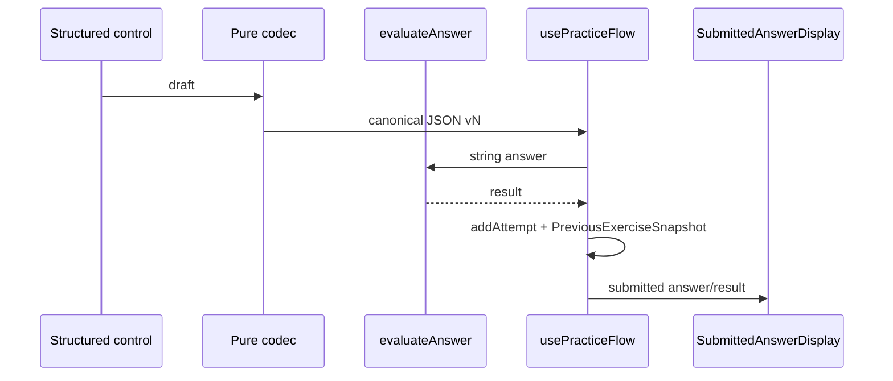

# Design: Unit 5 Foundation

## Technical Approach

Plans receipts, retirement, and delivery.

## Decisions

| Area | Decision and rationale |
|---|---|
| Receipt placement | **Proposed U5-00 artifacts**: `source-receipts.json` and `traceability.md` in this change directory. Receipt schema: `{logicalSourceId,observedFilename,pageCount,sha256,materialEvidence,use}`; trace rows hold item/subitem, theory pages, skill, difficulty, answer kind, errors, exam relation. Register only proposal’s four IDs; PDFs remain external, hashes informative, evidence repository-relative. Material conflict blocks; hash-only mismatch is reviewed. |
| Retirement | Exact six provisional `mat.u5.*` and five `ex.u5.*.1` allowlists are in `exploration.md`. Live surfaces: `src/domain/models/skill-catalog.ts` (`UNIT_5_SKILLS`, `ALL_SKILLS`, `KNOWN_SKILL_IDS`, `SKILL_DEPENDENCIES`), `src/domain/index.ts`, `FocusSelector.tsx`, exercises JSON, error taxonomy, named catalog/complex/diagnostic/evaluator tests, active complex-number spec, pedagogy maps. Archive is immutable; synthetic `mat.u5.trigonometria_basica`, `ex.u5.bad.1`, `ex.u5.good.1` are not migration keys. |
| Catalog | Replace with exactly the nine IDs and exact DAG in `specs/math-skill-model/spec.md`; no alias or U4 edge. Existing `mat.u1.complejos` remains prerequisite. `mat.u5.ecuaciones_trigonometricas` is deliberately reused only after retirement. |
| Local marker | **Proposed key** `pre-utn.u5-retirement.v1`; absent=`pending`; JSON `{version:"retired-v1",students:{[studentId]:{completedAt:string}}}`. Existing `PracticeProgressMap`, `DiagnosticMap`, `StudyPlanMap` remain in `pre-utn.practice.v1`, `pre-utn.diagnostic.v1`, `pre-utn.study-plan.v1` (`src/lib/{practice-progress,diagnostic-storage}.ts`); profiles remain `pre-utn.profiles.v1`. Per student: transform, persist and reread all three, then mark last. They are non-transactional: a pre-marker crash safely reruns the pure transform. A startup gate in `src/lib/persistence/{local-adapter,adapter-config}.ts` blocks writes. U5-01 has no content and U5-02+ releases after the gate, preventing reused-ID races. |
| Remote marker | **Proposed column** `student_progress_snapshots.u5_retirement_version text NOT NULL`. One `supabase/migrations/` transaction marks existing rows `pending`, transforms JSONB `practice_progress`, `diagnostic_result`, `study_plan`, then marks `retired-v1`; null/empty rows complete. New rows default `retired-v1`; future profiles without snapshots need nothing. Supabase migration ledger records it. `createSupabaseAdapter` selects marker plus columns and fails closed on pending; upserts preserve default. Rollback restores backup; fix-forward is a new marker-aware version. |
| Structured answers | Add `structured`/`answerSpec.kind` to `ExerciseType`/`ExerciseBaseShape`/`EvaluableExercise` and `content-loaders.ts`; dispatch `evaluateAnswer`, render `ExerciseAnswerInput`, submit `usePracticeFlow.handleAnswerSubmit`, snapshot `previous-snapshot.ts`, display `SubmittedAnswerDisplay.tsx`. Pure versioned JSON preserves string APIs. First consumers: DMS/exact (02), ratios (03), set (07), complex/tuple (08), roots (10); never free-form. |

## Sequence Diagrams

```mermaid
sequenceDiagram
  participant C as Client
  participant G as Local write gate
  participant P as Three local maps
  participant M as u5-retirement key
  C->>G: initialize/load
  G->>M: marker(studentId)?
  alt pending
    G->>P: transform and persist all; reread verify
    G->>M: write retired-v1 last
  end
  G-->>C: permit read/write
```

```mermaid
sequenceDiagram
  participant SQL as Supabase migration transaction
  participant S as student_progress_snapshots
  participant A as createSupabaseAdapter
  SQL->>S: transform JSONB; set version retired-v1
  A->>S: select JSONB plus marker
  alt pending or missing
    A-->>A: fail closed
  else retired-v1
    A-->>A: load/save snapshot
  end
```



## Contracts and Safeguards

Fractions/radicals and DMS normalize; tuples are ordered. Angular sets/root lists are **sets**: sort/deduplicate, permutation allowed, never multiplicity. Ratios compare named cells/`undefined`; complex equality is `(re,im)`. Enforce quadrant-selected ±, `sqrt(x²)=|x|`, `atan2` axes/quadrants, modulus, bounded/periodic/no-solution sets, and De Moivre roots (`2kπ`, modulus root). Invalid shape is deterministic `configuration_error`; domain remains framework-free.

## Slice Ownership and Tests

| Slice | Ownership: canonical items / acceptance | Principal RED tests; split condition |
|---|---|---|
| U5-00 | receipts, 1–22 trace (22.a retained; 22.b excluded), design | artifact audit; split only artifact review >800 |
| U5-01 | retirement/migration only | marker, no-data, nested, parity, reused-ID; split local/remote |
| U5-02 | angles/arcs, 1–3; DMS/exact | conversion, bounds, arcs; split content/evaluator |
| U5-03 | ratios/signs, 5–6; six-ratio | ±, quadrant, undefined; split controls/content |
| U5-04 | reductions, 4 | all quadrant/axis relations; split content/tests |
| U5-05 | notable values, 7 | radical equivalence; split content/tests |
| U5-06 | identities, 8,9,12 | domain-safe transformations; split content/tests |
| U5-07 | equations, 10,11,13,14; angular set | endpoints, none, roots; split controls/content |
| U5-08 | forms, 15–17,20,22.a; complex/tuple | atan2/modulus; split controls/content |
| U5-09 | rotations, 18–19 | preserved modulus/list determinism; split content/tests |
| U5-10 | roots, 21; root-list | all roots/De Moivre; split controls/content |
| U5-11 | diagnosis, exam/coverage QA | nine-DAG, full trace, E2E; split audit/E2E |

Each is stacked-to-main, independently green, owns rollback/tests, and splits above 800 authored lines. `mate-explorer` is optional/non-blocking. Reject MC-only, free-form parser, prefix deletion, semantic mapping, monolithic U5, and U4. **Normative count:** `unit-5-foundation/spec.md` defines eleven slices, U5-01 through U5-11; no further count correction is pending.

## Testing and Rollout

TDD is RED→GREEN→REFACTOR: pure local/remote fixtures prove identical transforms, restart safety, preservation of U1/U2/U3/U4/U6, and backup/fix-forward evidence; codec properties prove round-trip/idempotence/determinism; components prove accessibility/display. Run focused tests per work unit, then `pnpm run test`, `pnpm run typecheck`, `pnpm run build`; GGA/lifecycle receipts occur at commit/PR boundaries.

## Threat Matrix

N/A — no routing, shell, subprocess, VCS/PR automation, executable classification, or process integration.
