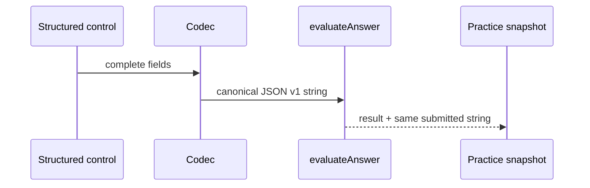

# Design: Unit 5 Angle and Arc Measurement

## Technical Approach

Implement the first live U5 packet using ADR-005 type dispatch and ADR-006 traced, pedagogically adapted content. U5-00's reserved structured-string architecture is consumed without changing snapshots or persistence.

## Architecture Decisions

| ID | Choice | Rejected / rationale |
|---|---|---|
| D1 | Add `structured` plus `answerSpec` to `ExerciseBaseShape` and `EvaluableExercise`; only `pi-rational` and `angle-dms`. | Free-text parser/MC substitution: violates the answer-form requirement and no-free-text rule. |
| D2 | Place pure v1 parse/normalize/serialize/evaluate helpers in `src/domain/evaluator/structured.ts`; loader uses the same expected-spec normalizer. | UI parsing or duplicated codecs: would make catalog validation and grading disagree. |
| D3 | Branch `evaluateAnswer` on `structured` before manual/legacy switches; malformed submission is incorrect, malformed expected content is a load-time configuration error. | Replacing numeric paths: would regress U1/U2 and scalar U5 items. |
| D4 | Use three gated pure detectors in `error-tagging.ts`. | Prompt-text heuristics or undeclared tags: produces false pedagogical signals. |
| D5 | Controls submit canonical JSON through the existing string API; snapshot/display remain string-based. | New persistence shape: unnecessary migration surface. |

## Interfaces / Contracts

```ts
type StructuredAnswerSpec =
 | { kind: "pi-rational"; expected: { numerator: number; denominator: number }; decimal: number; tolerance: number }
 | { kind: "angle-dms"; expected: { degrees: number; minutes: number; seconds: number }; tolerance: number };
// ExerciseBaseShape/EvaluableExercise: answerSpec?: StructuredAnswerSpec
type StructuredSubmissionV1 =
 | { v: 1; kind: "pi-rational"; numerator: number; denominator: number; decimal: number }
 | { v: 1; kind: "angle-dms"; degrees: number; minutes: number; seconds: number };
```

`parseStructuredSubmissionV1`, `normalizePiRational`, `normalizeAngleDms`, and `serializeStructuredSubmissionV1` are pure. π integers are reduced by GCD, denominator is positive, and sign stays on numerator; decimal/tolerance are finite and tolerance > 0. DMS has integer, non-negative degrees/minutes, finite non-negative seconds, minutes/seconds < 60, and non-negative total. The loader parses `answerSpec` in `applyExerciseDefaults`; invalid/missing/unknown spec throws an error naming the exercise (therefore `loadCatalog` reports `configuration_error` semantics and excludes it). Submission parse/type/bounds failures return `{correct:false}`.

π grading requires normalized coefficient equality and `abs(decimal-expected.decimal) <= tolerance`. DMS compares total arc-seconds with `abs(delta) <= tolerance` (U5 2d: 0.5). `evaluateAnswer` tags only after an incorrect structured result.

Detectors parse v1 safely: degree/radian fires for 1a/1b only when submitted reduced coefficient equals the prompt degree fraction (`36/180`, `225/180`) while expected differs; DMS fires on parsed out-of-bounds values or an in-range total-second miss within 1 second of expected; arc-time fires for `.3` when submitted coefficient/decimal equals the half-time result `4π`, `12.5663` within declared decimal tolerance. Each returns its tag only when `commonErrorTags` declares it.

## Data Flow



`ExerciseAnswerInput` keeps local structured drafts, serializes only complete fields, and renders numerator/denominator/decimal or labelled degree/minute/second numeric inputs (integer/bounds hints and labels). `exercise-answer-state.ts` owns completeness/serialization; `submitted-answer-display.ts` parses defensively into coefficient/decimal or D/M/S read-only rows. No `PreviousExerciseSnapshot` change.

## Content and Wiring

Create the four `content/matematica/{theory,examples,feedback,exercises}/unit-5.json` files: node `theory-medicion-angulos-y-arcos`, five concepts (DMS; degree/radian; decimal-DMS rounding; radian/arc; elapsed fraction), examples `example-u5-{conversion,arco-dms,reloj}`, and seven ordered exercises `.1a,.1b,.1c,.1d,.2r,.2d,.3` at difficulties 1,1,2,3,3,4,4. All use Spanish KaTeX `$...$`, non-tutor voice, individually trace `mat.u5.practice` item plus `mat.u5.theory` pp. 7–9; feedback maps the three tags to the nearest concept/example without answers. 2r stays numerical `0.2`; 2d is DMS.

Register U5 imports in `content-loaders.ts` (`RAW_REGISTRY`, `UNIT_EXERCISE_FILES[5]`, threshold 7) and `catalog/index.ts` composition. Add the skill to `UNIT_5_SKILLS`, `PILOT_SKILLS`, taxonomy, and learn-page `UNIT_LABELS`/`UNIT_KEYS`; no dependency. Update exact count/order guards and add a dual-path equality guard.

## File Changes

| File group | Action | Description |
|---|---|---|
| `src/domain/models/exercise.ts`, `evaluator/{index,structured,error-tagging}.ts` | Modify/Create | Model, codecs, dispatcher, detectors. |
| `src/domain/catalog/{content-loaders,index,pilot-skills,readiness}.ts`, `models/skill-catalog.ts`, `error-taxonomy/index.ts` | Modify | Content composition, readiness and U5 registration. |
| `src/components/exercises/{ExerciseAnswerInput,exercise-answer-state,submitted-answer-display}.ts*`, `src/app/learn/matematica/page.tsx` | Modify | Controls, display, learn card. |
| four U5 JSON files and focused tests | Create/Modify | Canonical packet and guards. |

## Testing Strategy

RED first: codec/model/load failures and evaluator exact/tolerance/malformed cases; detector declared-tag gates; control serialization/display/a11y; then U5 content, dual-registration, pilot/count/order/readiness and FocusSelector re-enable tests. Add rendered visible-flow tests: select U5, reach theory/examples, submit π and DMS, receive grade/feedback; retain U1/U2 evaluator suites and scalar 1c/1d numerical regressions. Extend the voice scan to all four U5 files. Run `pnpm run test`, `pnpm run typecheck`, `pnpm run build`.

## Budget / Threat Matrix / Rollout

Caps: domain/evaluator ≤200, controls/display ≤160, content ≤240, wiring ≤85, flow/regression ≤115 (800 total). If trending over: share fixtures/helpers and shorten prose; never remove canonical interactions or add later kinds. N/A — no routing, shell, subprocess, VCS/PR automation, executable classification, or process integration. No migration required.

## Open Questions

None.
